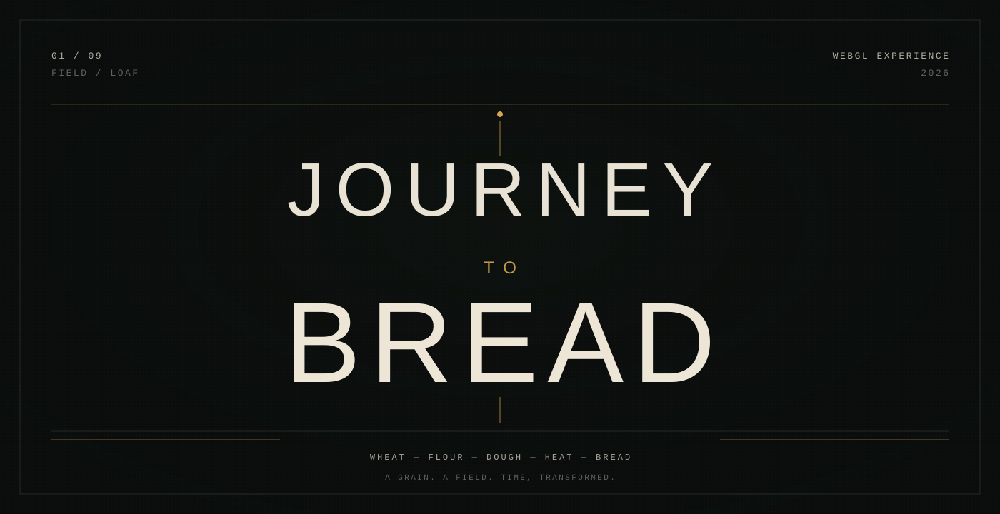
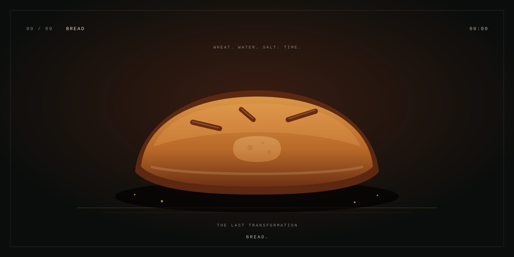

<p align="center">
  
</p>

<p align="center">
  <sub>A SCROLL-DRIVEN WEBGL PASSAGE FROM FIELD TO FINISHED LOAF.</sub>
  <br><br>
  <a href="https://chrisriv10.github.io/JourneytoBread/"><strong>ENTER THE EXPERIENCE</strong></a>
</p>

<br>

<p align="center">
  
</p>

<p align="center">
  <sub>01 WHEAT　·　02 GRAIN　·　03 MILLING　·　04 FLOUR　·　05 MIXING　·　06 DOUGH　·　07 PROOFING　·　08 OVEN　·　09 BREAD</sub>
</p>

<br>

<p align="center"><sub>THE JOURNEY</sub></p>

One grain moves through the quiet choreography of bread: field, mill, flour, water, dough, heat. Scroll through nine deliberate transformations and stay with the process until the final loaf arrives.

<p align="center">
  <sub>THREE.JS　/　GSAP　/　LENIS　/　TYPESCRIPT　/　VITE</sub>
</p>

<br>

<p align="center"><sub>LOCAL</sub></p>

```bash
npm install
npm run dev
```

<p align="center">
  <br>
  <strong>BREAD.</strong>
  <br>
  <sub>WHEAT. WATER. SALT. TIME.</sub>
</p>
